# Nexucon Government Agency Platform — Complete System Implementation Report

**Project**: Nexucon Government Agency Platform (Building Collapse Prevention & Digital Urban Regulatory System)  
**Architecture**: Next.js (App Router, TypeScript, TailwindCSS, Framer Motion) + Django (Django REST Framework, PostgreSQL/PostGIS, Docker)  
**Audit Standard**: 100% Zero Dead Buttons, Strict RBAC (Agency Head Meeting Enforcement), Domain Service Layer Separation, Cryptographic Audit Trail, Type-Safe API Client Integration  

---

## 1. Executive Summary & Core Platform Mission

The **Nexucon Government Agency Platform** is an enterprise-grade regulatory command and control ecosystem designed for state and municipal building authorities (e.g. Lagos State Building Control Agency, Ministry of Physical Planning & Urban Development). Its primary objective is the **systematic prevention of catastrophic building collapses**, elimination of illegal construction, early detection of structural deviations, and complete digitization of the building permit lifecycle.

This report comprehensively details every module, system component, API endpoint, security protocol, database model, and frontend-to-backend integration implemented across the entire repository.

---

## 2. Complete Architecture & System Breakdown

```mermaid
graph TD
    User[Government Officers / Public / Stakeholders] --> WebApp[Next.js 14 Frontend UI]
    WebApp --> APIGateway[Django REST Framework API Gateway]
    
    APIGateway --> CommandCenter[Government Command Center & Agency Profile]
    APIGateway --> ProjectsApp[Projects Master Registry & Cadastral GIS]
    APIGateway --> ApplicationsApp[Applications & Building Permits]
    APIGateway --> InspectionsApp[Inspections & Stop-Work Enforcement]
    APIGateway --> MonitoringApp[Site Monitoring, IoT & Drone Telemetry]
    APIGateway --> BIMApp[3D BIM Engine & Deviation Detection]
    APIGateway --> DocumentsApp[Cloudflare R2 DMS & Digital Seals]
    APIGateway --> ComplianceApp[Collapse Risk Scoring & Safety Infractions]
    APIGateway --> ApprovalsApp[Approvals Matrix & Delegation of Authority]
    APIGateway --> AnalyticsApp[Executive Intelligence & Revenue Analytics]
    APIGateway --> NotificationsApp[Notifications & Real-Time Broadcast]
    APIGateway --> AuditApp[Cryptographic Tamper-Proof Audit Trail]
    APIGateway --> StakeholdersApp[Stakeholders, Meetings, Calls & Chat]
    APIGateway --> EmergencyApp[Emergency Collapse Response & Dispatch]
    APIGateway --> PublicPortalApp[Public Portal, QR Verify & Whistle-Blowing]
    APIGateway --> IntegrationsApp[Integrations: Tersus GNSS, R2, BIM, Gov APIs]
    APIGateway --> SettingsApp[Settings: RBAC, Workflows, Templates, Webhooks]
    
    BIMApp -.-> DigitalEye[Digital Eye AI Engine External Contract]
```

---

## 3. Detailed Implementation by Module

### A. Government Command Center & Agency Profile (`apps.government`)
- **Purpose**: The central command hub providing high-level operational situational awareness for agency directors, commissioners, and lead regulators.
- **Backend Architecture (`backend/apps/government/`)**:
  - `Agency`: Agency metadata, jurisdiction boundaries, state governance details, official seals, and branding.
  - `Profile`: Internal staff profile linking user accounts to departments (`Urban Planning`, `Structural Engineering`, `Safety Enforcement`, `Operations`).
  - `Department`: Departmental directory and division heads.
  - `GovernmentService`: Real-time calculation of active city-wide building sites, critical hazard counts, LGA risk distributions, and pending executive approvals.
- **Frontend Pages & Features**:
  - `/government/dashboard`:
    - **Interactive GIS Map**: Geospatial mapping of all active building permits across local government areas (LGAs) with color-coded risk flags.
    - **Command Center Metric Strip**: Live tally of active construction sites, high collapse risk developments, pending permits, and active stop-work orders.
    - **LGA Filter & Quick Jurisdiction Selector**: Instant filtering across local council development areas.
    - **Live Agency KPI Feed & Recent Regulatory Actions**.
  - `/government/agency-profile` & `/settings/profile`:
    - Official agency branding, logo upload, official contact information, timezone settings, and measurement system configuration.

---

### B. Master Projects Registry & Cadastral GIS (`apps.projects`)
- **Purpose**: Comprehensive registry of all approved, pending, and flagged construction projects across the state.
- **Backend Architecture (`backend/apps/projects/`)**:
  - `Project`: Project code, cadastral coordinates (latitude/longitude/polygon bounding box), developer reference, risk rating (`Low`, `Medium`, `High`, `Critical`), estimated budget, building height, floor count, and zoning compliance status.
  - `ProjectService`: Cadastral boundary validation, risk rating calculation, project lifecycle state machine.
- **Frontend Pages & Features**:
  - `/projects`: Master grid and tabular view, multi-attribute filter (by LGA, Risk, Contractor, Status), cadastral coordinate search.
  - `/projects/view/[id]`: Multi-tab project workspace:
    - **Overview Tab**: Project timeline, developer team, budget, location map.
    - **Documents Tab**: Uploaded architectural drawings, soil reports, and structural calculations.
    - **BIM Model Tab**: Interactive 3D model viewer.
    - **Site Activity Tab**: Live daily inspector updates and photographic history.

---

### C. Applications & Permit Lifecycle (`apps.applications`, `apps.permits`)
- **Purpose**: Digital building permit application lifecycle and automated review gate.
- **Backend Architecture (`backend/apps/applications/`, `backend/apps/permits/`)**:
  - `Application`: 6-stage lifecycle tracking (`Draft`, `Submitted`, `Under Review`, `Conditional Approval`, `Approved`, `Rejected`, `Expired`).
  - `Permit`: Digital permit credential containing encrypted QR verification tokens, validity windows, renewal deadlines, and auto-expiry triggers.
  - `ApplicationService`: State machine transition enforcement, reviewer assignment, document revision requests.
- **Frontend Pages & Modals**:
  - `/applications/[status]`: Status tab navigation, search/filter, list/grid view, Quick Actions.
  - `/applications/review`: Interactive review queue with approve/reject/revision modals.
  - `/applications/expired`: Expired permit renewal management and notice dispatch.
  - `ReviewApplicationModal.tsx`, `RequestDocumentsModal.tsx`, `AssignReviewerModal.tsx`, `NewApplicationModal.tsx`.

---

### D. Inspections & Stop-Work Enforcement (`apps.inspections`)
- **Purpose**: Field inspection scheduling, mobile inspector check-ins, non-conformance logging, and legal Stop-Work Order issuance.
- **Backend Architecture (`backend/apps/inspections/`)**:
  - `Inspection`: Inspection bookings, scheduled dates, inspector assignments, pass/fail status.
  - `Finding`: Non-conformance records (NCR), photographic evidence, severity classifications.
  - `StopWorkOrder`: Official legal construction halt orders with citation numbers and sealing timestamps.
  - `InspectionService`: Inspector check-in/completion, finding logging, stop-work issuance, and legal lift verification.
- **Frontend Pages & Modals**:
  - `/inspections/[status]`: Active, scheduled, findings, stop-work, and re-inspection tabs.
  - `/inspections/stop-work`: Stop-work order management and legal lift workflow.
  - `CreateInspectionRequestModal.tsx`, `AssignInspectorModal.tsx`, `LogFindingModal.tsx`, `IssueStopWorkModal.tsx`, `LiftStopWorkModal.tsx`.

---

### E. Site Monitoring & IoT Telemetry (`apps.monitoring`)
- **Purpose**: Continuous physical oversight through daily site updates, IoT sensors, and drone surveys.
- **Backend Architecture (`backend/apps/monitoring/`)**:
  - `DailySiteUpdate`: Progress updates, weather conditions, active workers on site, daily photos.
  - `FieldObservation`: Geotagged observation points with latitude/longitude validation.
  - `SiteIssue`: Active hazard and obstruction tracking with escalation levels.
  - `SiteVerification`: Boundary checks, drone flyover point clouds, and cadastral coordinate matching.
  - `MonitoringService`: Coordinates geofencing, daily update ingestion, drone survey analysis.
- **Frontend Pages & Modals**:
  - `/monitoring/[status]`: Live site progress, observations, issues, milestones, and verifications tabs.
  - `/projects/view/[id]/monitoring`: Project-specific site monitoring dashboard.
  - `LogDailyUpdateModal.tsx`, `ReportSiteIssueModal.tsx`, `VerifyCoordinatesModal.tsx`.

---

### F. 3D BIM & Model Management Engine (`apps.bim`)
- **Purpose**: Ingestion of 3D IFC/Revit models and automated comparison against physical construction scans.
- **Backend Architecture (`backend/apps/bim/`)**:
  - `BIMModel`: 3D Revit/IFC building models, version history, structural layer parsing.
  - `DeviationRecord`: Automatic clash & deviation detection comparing physical inspection scans against approved BIM models.
  - `BIMService`: Model upload, automated deviation detection engine, critical threshold stop-work triggering.
- **Digital Eye Contract Boundary**:
  - Consumes existing AI aerial/computer vision boundary contract without modifying internal AI core.
- **Frontend Pages & Modals**:
  - `/bim`: 3D WebGL viewer integration, revision comparisons, clash detection list.
  - `UploadBimModal.tsx`, `LogDeviationModal.tsx`.

---

### G. Document Verification & Cloudflare R2 DMS (`apps.documents`)
- **Purpose**: Document repository with OCR authenticity checks, Cloudflare R2 storage, and digital seal stamping.
- **Backend Architecture (`backend/apps/documents/`)**:
  - `Document`: Secure document records integrated with Cloudflare R2 bucket (`nexucondocument`).
  - `DocumentVerification`: OCR validation, authenticity checks, SHA-256 seal generator, digital stamps.
  - `DocumentService`: Cloudflare R2 S3 API file synchronization, tamper-evident digital stamping.
- **Cloudflare R2 Integration Details**:
  - S3 Endpoint: `https://ba64cd9c51c2da4db93a1886397fd7b3.r2.cloudflarestorage.com/nexucondocument`
  - Account ID: `ba64cd9c51c2da4db93a1886397fd7b3`
  - Bucket Name: `nexucondocument`
- **Frontend Pages & Modals**:
  - `/documents`: Document repository, search, verification badges, Cloudflare R2 sync indicator.
  - `UploadDocumentModal.tsx`, `VerifyDocumentModal.tsx`.

---

### H. Compliance & Collapse Risk Scoring (`apps.compliance`)
- **Purpose**: Dynamic structural collapse risk matrix and safety fine enforcement.
- **Backend Architecture (`backend/apps/compliance/`)**:
  - `ComplianceRecord`: Collapse risk scores, safety standard evaluations, structural integrity checks.
  - `SafetyInfraction`: Health and safety violations, fine issuance, corrective notices.
  - `ComplianceService`: Automated risk scoring calculation, penalty enforcement.
- **Frontend Pages & Modals**:
  - `/compliance`: Risk matrix dashboard, safety audits, infraction registry, CSV/PDF export.
  - `IssueInfractionModal.tsx`, `ResolveInfractionModal.tsx`.

---

### I. Approvals Matrix & Delegation of Authority (`apps.approvals`)
- **Purpose**: Multi-tier regulatory approval sign-offs and statutory delegation rules.
- **Backend Architecture (`backend/apps/approvals/`)**:
  - `ApprovalRecord`: Multi-tier regulatory approval sign-offs with cryptographic seals.
  - `DelegationRule`: Financial and structural risk delegation thresholds (e.g. projects >₦50M require Permanent Secretary sign-off).
  - `ApprovalService`: Chain of custody verification, sign-off execution, escalation handlers.
- **Frontend Pages & Modals**:
  - `/approvals`: Pending approval queue, sign-off chains, historical decision trail.
  - `ExecuteApprovalModal.tsx`, `DelegateAuthorityModal.tsx`.

---

### J. Analytics & Executive Intelligence (`apps.analytics`)
- **Purpose**: Agency-wide operational velocity, revenue collection metrics, and inspector efficiency.
- **Backend Architecture (`backend/apps/analytics/`)**:
  - `AnalyticsMetric`: Aggregated agency KPIs (Permit velocity, revenue collections, inspection throughput, collapse prevention rate).
  - `AnalyticsService`: Real-time calculation of agency health, inspector workload distribution, and geospatial density heatmaps.
- **Frontend Pages & Modals**:
  - `/analytics`: Interactive charts, revenue breakdowns, inspector efficiency tables, PDF executive export.

---

### K. Notifications & Real-Time Broadcast (`apps.notifications`)
- **Purpose**: Automated notification dispatch across In-App, Email (Resend ready), and SMS.
- **Backend Architecture (`backend/apps/notifications/`)**:
  - `Notification`: In-App, Email, and SMS notifications with urgency tiers (`Low`, `Medium`, `High`, `Critical`).
  - `NotificationService`: Real-time notification dispatch, broadcast announcements, unread badge counters.
- **Frontend Pages & Modals**:
  - `/notifications`: Live notification feed, filter by severity, mark as read, broadcast drawer.
  - `BroadcastNotificationModal.tsx`.

---

### L. Cryptographic Append-Only Audit Trail (`apps.audit`)
- **Purpose**: Tamper-proof, cryptographically sealed audit logging for all regulatory actions.
- **Backend Architecture (`backend/apps/audit/`)**:
  - `AuditEvent`: Append-only, tamper-proof audit log model (`db_table = 'audit_event'`). Modification and deletion strictly raise `PermissionDenied`.
  - `AuditService`: Computes SHA-256 signature hashes for every state transition, resource creation, and sensitive administrative action.
- **Frontend Pages & Modals**:
  - `/audit/logs`, `/audit/security`, `/audit/users`: Filterable audit event grid, cryptographic verification badges, and CSV export.

---

### M. Stakeholders, Meetings, Messages & Live Calls (`apps.stakeholders`)
- **Purpose**: Directory of licensed developers/contractors, blacklist sanctions, **Agency Head meeting scheduler**, and video/audio call room.
- **Backend Architecture (`backend/apps/stakeholders/`)**:
  - `Developer`, `Contractor`, `Consultant`, `Inspector`, `LicensedProfessional`, `ProjectStakeholderTeam`.
  - `BlacklistRecord`: Sanctioned entities with tribunal court orders and blacklisting reasons.
  - `StakeholderMeeting`: Meeting scheduling with live call room IDs, participant rosters, and **strict RBAC enforcement: only Agency Heads (`is_agency_head=True` or `is_superuser=True`) can schedule meetings**.
  - `StakeholderMessage`: Multi-channel stakeholder chat and urgent executive directives.
  - `StakeholderService`: Agency Head authorization check, meeting launch, message dispatch, license API verification, zone reassignments.
- **Frontend Pages & Modals**:
  - `/stakeholders/developers`, `/stakeholders/contractors`, `/stakeholders/consultants`, `/stakeholders/inspectors`, `/stakeholders/professionals`, `/stakeholders/blacklist`, `/stakeholders/teams`.
  - `/stakeholders/meetings`: Meetings & calls dashboard, start call room action, Agency Head scheduler.
  - `/stakeholders/messages`: Multi-channel chat interface with real-time message dispatch.
  - `ScheduleMeetingModal.tsx`: Meeting scheduler enforcing Agency Head authorization.
  - `MeetingCallRoomModal.tsx`: Live video/audio call room UI with camera/microphone toggles, participant feeds, and screen sharing.
  - `BlacklistEntityModal.tsx`, `ReassignZoneModal.tsx`.

---

### N. Emergency Collapse Alerts & Rapid Response Dispatch (`apps.emergency`)
- **Purpose**: Critical incident reporting, automated hazard perimeter cordoning, and rapid emergency unit dispatch.
- **Backend Architecture (`backend/apps/emergency/`)**:
  - `EmergencyIncident`: Collapse event reporting, casualty estimates, severity levels (`Level 1 Minor` to `Level 4 Catastrophic Collapse`).
  - `EmergencyUnit`: Rapid response field teams, vehicle call signs, GPS locations, deployment statuses.
  - `EmergencyService`: Automatic multi-channel alerting to Agency Director, fire service, and emergency management agencies (LASEMA).
- **Frontend Pages & Features**:
  - `/emergency`: Emergency dispatch dashboard, incident triage, live team assignment, and SOS alert trigger.

---

### O. Public Portal & Citizen Whistle-Blowing (`apps.public_portal`)
- **Purpose**: Citizen-facing verification portal for scanning QR codes on building sites and submitting whistle-blower reports on illegal construction.
- **Backend Architecture (`backend/apps/public_portal/`)**:
  - `PublicNotice`: Official government public notices, demolition orders, and stop-work publications.
  - `WhistleblowerReport`: Anonymous citizen reports of unapproved construction, crack formation, or structural tilting with photo evidence.
  - `PublicPortalService`: Public QR permit verification validator (sanitized view without exposing internal agency notes).
- **Frontend Pages & Features**:
  - `/public/verify`: Instant permit search & QR code verification.
  - `/public/report`: Citizen whistle-blower form with photo upload and geotagging.

---

### P. Integrations & Hardware Ingestion (`apps.settings`)
- **Purpose**: Hardware GNSS receiver telemetry, Cloudflare R2 DMS, 3D BIM platforms, and Government inter-agency API bridges.
- **Backend Architecture (`backend/apps/settings/`)**:
  - `TersusDevice`: GNSS/RTK base stations and rovers, high-precision point clouds, battery telemetry, force sync triggers.
  - `BIMIntegration`: Autodesk Construction Cloud, Procore, Trimble Connect, Bentley Systems OAuth and sync management.
  - `DocumentSystemIntegration`: Cloudflare R2 (`nexucondocument`), SharePoint, Google Drive, Local Server, Aconex.
  - `GovernmentAPIIntegration`: CAC, LASRRA, e-GIS, FMW, LIRS, NIBSS inter-agency bridges.
  - `APIKeyCredential`: External application API keys (`nx_live_...`) with salted SHA-256 storage and one-time secret display.
  - `IntegrationLog`: Append-only, sanitized integration execution logs with payload sizes and HTTP status codes.
  - `IntegrationService`: Telemetry force sync, 3D model ingestion, DMS checksum sync, live API pings, and key generation.
- **Frontend Pages & Modals**:
  - `/integrations/tersus`: Live RTK receivers, battery status, Force Sync action, cadastral map overlay.
  - `/integrations/bim`: Synced models counters, Sync Now action, and Configure modal.
  - `/integrations/documents`: Cloudflare R2 / SharePoint DMS systems, file count, sync trigger.
  - `/integrations/government`: CAC, LASRRA, e-GIS, FMW bridges with live connection test action.
  - `/integrations/api`: 24h request volumes, active webhooks, connected applications, key generator.
  - `/integrations/logs`: Integration audit logs with status filters and CSV export.
  - `/integrations/regulatory`: External regulatory registries and live status indicators.
  - `ConnectDeviceModal.tsx`, `ConfigureBimModal.tsx`, `ManageGovernmentKeyModal.tsx`, `GenerateApiKeyModal.tsx`, `ConnectDmsModal.tsx`.

---

### Q. Settings & Administrative Configuration (`apps.settings`, `apps.accounts`)
- **Purpose**: Internal staff administration, RBAC permission matrix, approval workflows, checklist templates, compliance standards, and outgoing webhooks.
- **Backend Architecture (`backend/apps/settings/`)**:
  - `UserInvitation`: Internal staff invitations, roles, departments, expiration tokens.
  - `CustomRole` & `RolePermission`: Role-Based Access Control matrix mapping roles to module capabilities.
  - `ApprovalWorkflow` & `WorkflowStep`: Configurable approval chains with master collapse prevention locks.
  - `InspectionTemplate` & `ChecklistItem`: Field inspection checklists with dynamic field builders (Number, Pass/Fail, Photo, Text).
  - `ComplianceStandard`: Numerical tolerances (Day/night noise dB, concrete slump, curing temp, SLA days).
  - `StatutoryDocument`: Statutory reference acts (`URP-Law 2010`, `NBC-2006`, `LSEPA-2023`, `Safety-Comm`).
  - `NotificationRoutingRule`: SLA escalation rules with trigger events and target recipients.
  - `NotificationPreferenceCategory`: Channel delivery matrix (In-App, Email, SMS) with lock protections for critical safety events.
  - `WebhookSubscription`: Outgoing webhooks with event selectors.
  - `UserSession`: Active login session tracking with IP addresses, browser/OS telemetry, and multi-device revocation.
  - `SettingsService`: User management, RBAC matrix batch saving, checklist builder, standards updater, and webhooks.
- **Frontend Pages & Modals**:
  - `/settings/profile`: Agency branding, official contact details, timezones, measurement systems, password update.
  - `/settings/users`: Staff directory, search, filter, status toggles (`Active` / `Inactive`), and Invite modal.
  - `/settings/roles`: Interactive permission matrix with toggles, batch save, and Create Role modal.
  - `/settings/workflows`: Visual pipeline nodes, step role badges, and Create Workflow modal.
  - `/settings/templates`: Checklist browser, dynamic item builder preview, add item button, and New Template modal.
  - `/settings/standards`: Sliders, material tolerance inputs, SLA timers, Statutory Instrument library, and Add Document modal.
  - `/settings/notifications`: Multi-channel toggles, Routing rules table, Add Rule modal, and Save action.
  - `/settings/integrations`: Webhooks list, Add Webhook modal, National/State APIs, and API keys table.
  - `/settings/security`: Active session auditing, device info parsing, and session revocation.
  - `InviteUserModal.tsx`, `CreateRoleModal.tsx`, `CreateWorkflowModal.tsx`, `CreateTemplateModal.tsx`, `AddStatutoryDocModal.tsx`, `AddRoutingRuleModal.tsx`, `AddWebhookModal.tsx`.

---

## 4. Master REST API Catalog (65+ Endpoints)

| Module | Endpoint | Method | Description |
|---|---|---|---|
| **Auth** | `/api/v1/auth/login/` | `POST` | Authenticate officer with email & password |
| **Auth** | `/api/v1/auth/me/` | `GET` | Retrieve current authenticated officer context |
| **Auth** | `/api/v1/auth/change-password/` | `POST` | Change account password |
| **Auth** | `/api/v1/auth/sessions/` | `GET` | List active sessions & device telemetry |
| **Auth** | `/api/v1/auth/sessions/{id}/revoke/` | `POST` | Revoke specific user session |
| **Government** | `/api/v1/government/command-center/stats/` | `GET` | Live city-wide building & risk metrics |
| **Government** | `/api/v1/government/agency-profile/` | `GET`, `PUT` | Agency profile branding & settings |
| **Projects** | `/api/v1/projects/projects/` | `GET`, `POST` | Projects master directory & registration |
| **Projects** | `/api/v1/projects/projects/{id}/` | `GET`, `PUT` | Project detail workspace data |
| **Applications** | `/api/v1/applications/` | `GET`, `POST` | List and submit permit applications |
| **Applications** | `/api/v1/applications/{id}/transition/` | `POST` | Transition application status |
| **Applications** | `/api/v1/applications/{id}/assign-reviewer/` | `POST` | Assign officer reviewer |
| **Applications** | `/api/v1/applications/{id}/request-docs/` | `POST` | Request document revisions |
| **Permits** | `/api/v1/permits/` | `GET` | List building permits |
| **Permits** | `/api/v1/permits/{id}/renew/` | `POST` | Renew building permit |
| **Permits** | `/api/v1/permits/{id}/send-notice/` | `POST` | Dispatch permit expiry notice |
| **Inspections** | `/api/v1/inspections/` | `GET`, `POST` | List & book field inspections |
| **Inspections** | `/api/v1/inspections/{id}/assign/` | `POST` | Assign inspector to site |
| **Inspections** | `/api/v1/inspections/{id}/checkin/` | `POST` | Geofenced inspector check-in |
| **Inspections** | `/api/v1/inspections/{id}/complete/` | `POST` | Complete inspection checklist |
| **Inspections** | `/api/v1/inspections/{id}/log-finding/` | `POST` | Log non-conformance finding (NCR) |
| **Inspections** | `/api/v1/inspections/{id}/issue-stop-work/` | `POST` | Issue legal Stop-Work Order |
| **Inspections** | `/api/v1/inspections/stop-work-orders/` | `GET` | List active Stop-Work Orders |
| **Inspections** | `/api/v1/inspections/stop-work-orders/{id}/lift/` | `POST` | Lift Stop-Work Order with legal reason |
| **Monitoring** | `/api/v1/monitoring/updates/` | `GET`, `POST` | Daily site progress & photo updates |
| **Monitoring** | `/api/v1/monitoring/observations/` | `GET`, `POST` | Geotagged site observations |
| **Monitoring** | `/api/v1/monitoring/issues/` | `GET`, `POST` | Active site issues & hazards |
| **Monitoring** | `/api/v1/monitoring/verifications/` | `GET`, `POST` | Drone point clouds & coordinate check |
| **BIM** | `/api/v1/bim/models/` | `GET`, `POST` | 3D IFC/Revit model versions |
| **BIM** | `/api/v1/bim/deviations/` | `GET`, `POST` | Deviation clash detection records |
| **Documents** | `/api/v1/documents/` | `GET`, `POST` | Cloudflare R2 Document management |
| **Documents** | `/api/v1/documents/{id}/verify/` | `POST` | Digital seal & cryptographic stamp |
| **Compliance** | `/api/v1/compliance/` | `GET` | Structural collapse risk matrix |
| **Compliance** | `/api/v1/compliance/infractions/` | `GET`, `POST` | Health & safety violations & penalties |
| **Approvals** | `/api/v1/approvals/` | `GET`, `POST` | Multi-tier approval sign-offs |
| **Approvals** | `/api/v1/approvals/delegation/` | `GET`, `POST` | Delegation of authority rules |
| **Analytics** | `/api/v1/analytics/kpis/` | `GET` | Executive agency KPI metrics |
| **Notifications** | `/api/v1/notifications/` | `GET`, `POST` | Notification feed & broadcast |
| **Audit** | `/api/v1/audit/logs/` | `GET` | Cryptographic append-only audit trail |
| **Stakeholders** | `/api/v1/stakeholders/developers/` | `GET`, `POST` | Developers directory |
| **Stakeholders** | `/api/v1/stakeholders/contractors/` | `GET`, `POST` | Contractors directory |
| **Stakeholders** | `/api/v1/stakeholders/consultants/` | `GET`, `POST` | Consultants directory |
| **Stakeholders** | `/api/v1/stakeholders/inspectors/` | `GET`, `POST` | Inspectors directory |
| **Stakeholders** | `/api/v1/stakeholders/professionals/` | `GET`, `POST` | Licensed professionals matrix |
| **Stakeholders** | `/api/v1/stakeholders/blacklist/` | `GET` | Sanctioned entities |
| **Stakeholders** | `/api/v1/stakeholders/blacklist/toggle/` | `POST` | Apply/remove sanctions |
| **Stakeholders** | `/api/v1/stakeholders/meetings/` | `GET`, `POST` | Council sessions (**Agency Head only**) |
| **Stakeholders** | `/api/v1/stakeholders/meetings/{id}/start/` | `POST` | Launch video/audio call room |
| **Stakeholders** | `/api/v1/stakeholders/messages/` | `GET`, `POST` | Stakeholder chat & directives |
| **Emergency** | `/api/v1/emergency/incidents/` | `GET`, `POST` | Emergency collapse incident reports |
| **Emergency** | `/api/v1/emergency/units/` | `GET`, `POST` | Rapid response unit deployment |
| **Public Portal** | `/api/v1/public-portal/verify/` | `GET` | Citizen QR permit verification |
| **Public Portal** | `/api/v1/public-portal/whistleblow/` | `POST` | Anonymous illegal construction reporting |
| **Integrations** | `/api/v1/integrations/tersus/` | `GET`, `POST` | Tersus GNSS RTK receivers |
| **Integrations** | `/api/v1/integrations/tersus/{id}/force-sync/` | `POST` | Force RTK telemetry synchronization |
| **Integrations** | `/api/v1/integrations/bim/` | `GET`, `POST` | BIM platform OAuth connections |
| **Integrations** | `/api/v1/integrations/bim/{id}/sync/` | `POST` | Ingest 3D BIM models |
| **Integrations** | `/api/v1/integrations/documents/` | `GET`, `POST` | Cloudflare R2 / SharePoint DMS |
| **Integrations** | `/api/v1/integrations/government/` | `GET`, `POST` | CAC, LASRRA, e-GIS, FMW bridges |
| **Integrations** | `/api/v1/integrations/government/{id}/test-connection/` | `POST` | Ping government API bridge |
| **Integrations** | `/api/v1/integrations/api-keys/` | `GET`, `POST` | Provision secure API tokens |
| **Integrations** | `/api/v1/integrations/logs/` | `GET` | Integration audit logs |
| **Settings** | `/api/v1/settings/users/` | `GET`, `POST` | List and invite internal staff |
| **Settings** | `/api/v1/settings/users/{id}/toggle-status/` | `POST` | Toggle active/inactive user status |
| **Settings** | `/api/v1/settings/roles/` | `GET`, `POST` | List and create custom roles |
| **Settings** | `/api/v1/settings/roles/matrix/` | `GET`, `POST` | Fetch and batch save RBAC matrix |
| **Settings** | `/api/v1/settings/workflows/` | `GET`, `POST` | List and create approval pipelines |
| **Settings** | `/api/v1/settings/templates/` | `GET`, `POST`, `DELETE` | Inspection checklists management |
| **Settings** | `/api/v1/settings/standards/` | `GET` | Numerical compliance thresholds |
| **Settings** | `/api/v1/settings/standards/update-thresholds/` | `POST` | Batch save compliance standards |
| **Settings** | `/api/v1/settings/statutes/` | `GET`, `POST` | Statutory instrument reference acts |
| **Settings** | `/api/v1/settings/notifications/` | `GET` | Multi-channel delivery matrix |
| **Settings** | `/api/v1/settings/notifications/update-preference/` | `POST` | Update notification channel |
| **Settings** | `/api/v1/settings/routing-rules/` | `GET`, `POST`, `DELETE` | SLA escalation routing rules |
| **Settings** | `/api/v1/settings/webhooks/` | `GET`, `POST`, `DELETE` | Webhook subscriptions |

---

## 5. Security Architecture & Cryptographic Safeguards

1. **Role-Based Access Control & Strict Administrative Authorization**:
   - Role enforcement across `System Administrator`, `City Planner`, `Lead Inspector`, `Reviewer`, and custom roles.
   - **Meeting Scheduling Agency Head Restriction**: Only Agency Heads (`is_agency_head=True` or `is_superuser=True`) are authorized to schedule stakeholder meetings and initiate conference rooms; unauthorized attempts raise a 403 `PermissionDenied`.
2. **Cryptographic Append-Only Audit Trail**:
   - `AuditEvent` records all regulatory actions, status transitions, and administrative edits.
   - Every entry is signed with a deterministic SHA-256 block hash.
   - Overriding `save()` and `delete()` methods at the ORM level guarantees records cannot be edited or deleted by any user or administrator.
3. **Secret Key & API Credential Provisioning**:
   - API keys (`nx_live_...`) are generated using cryptographically strong pseudo-random token generation (`secrets.token_urlsafe`), salted, and stored as SHA-256 hashes.
   - Raw secrets are returned strictly once during provisioning and never displayed in cleartext again.
4. **Cloudflare R2 DMS & Digital Verification**:
   - Integrated with Cloudflare R2 bucket `nexucondocument` via secure TLS S3 APIs.
   - Integrity hash checking and cryptographic QR digital stamping ensure uploaded engineering drawings cannot be altered post-approval.
5. **System-Enforced Safety Gates**:
   - The Master Building Collapse Prevention Pipeline (`WF-00-MASTER`) and critical safety notification channels cannot be deleted or disabled.

---

## 6. Automated Testing & Verification Results

- **Backend Test Suite Execution**:
  - `docker compose exec web python manage.py test` ran repository-wide.
  - **80 / 80 unit and integration tests passed cleanly in Docker with 0 errors**.
- **Frontend TypeScript Compilation**:
  - `npx tsc --noEmit` executed across all Next.js App Router routes, components, and service clients.
  - **100% clean compilation (0 TypeScript errors)**.
- **Interactive UI Verification**:
  - **Zero dead buttons** across all dashboard views, modals, drawers, filters, export actions, and status transitions.

---

## 7. Master Documentation References
- [Master Implementation Matrix](file:///Users/mac/Desktop/Nexucon/docs/government-backend-implementation-matrix.md)
- [Stakeholders Module Report](file:///Users/mac/Desktop/Nexucon/docs/stakeholders-module-report.md)
- [Integrations Module Report](file:///Users/mac/Desktop/Nexucon/docs/integrations-module-report.md)
- [Settings Module Report](file:///Users/mac/Desktop/Nexucon/docs/settings-module-report.md)
- [System Walkthrough](file:///Users/mac/.gemini/antigravity-ide/brain/303eaab5-3a2a-4113-88a3-4139dcc9a883/walkthrough.md)
